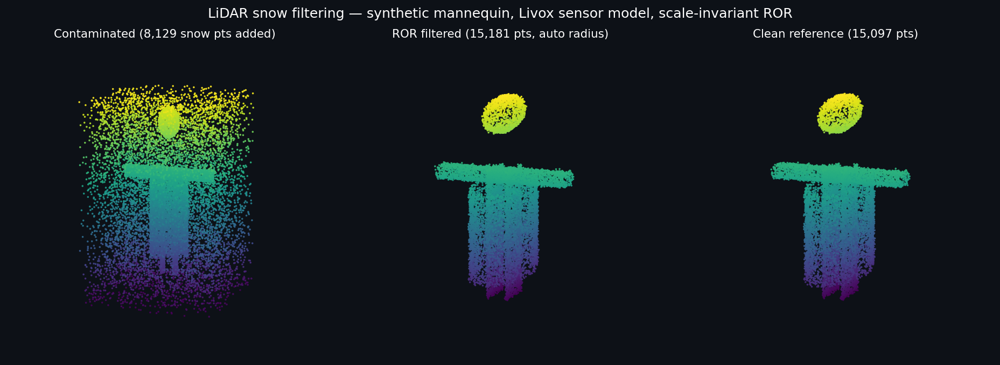

# LiDAR Snow Filtering

[](https://github.com/ARAVINDPM/pointcloud-snow-filter-ros2-portfolio/actions/workflows/test.yml)
[](https://python.org)
[](LICENSE)

Classical point-cloud outlier filtering for snow-contaminated LiDAR scans, with a
reproducible synthetic benchmark pipeline and an optional ROS2 node.



*Generated by `make demo` — synthetic mannequin (Livox sensor model), 35% snow
contamination, removed by scale-invariant ROR while preserving object geometry.*

Based on my master's thesis at OTH Regensburg (grade 1.3): *A Quantitative
Comparison of LiDAR Snow-Filtering Methods for Object Geometry Preservation*,
benchmarked on SICK multiScan165 and Livox Horizon sensors.

## What's here

- **Four filters** (`src/lidar_snow_filter/filters.py`): SOR, ROR, plus two
  project-specific adaptive variants — height-adaptive SOR (DSOR) and
  azimuth-adaptive ROR (DROR). Search radii are auto-estimated from median
  nearest-neighbor spacing, so the same defaults work on metre- and
  centimetre-unit clouds.
- **Evaluation metrics** (`metrics.py`): AABB IoU, voxel IoU, Chamfer distance,
  centroid displacement, point retention.
- **Synthetic pipeline** (`synthetic_data_generator.py`): parametric mannequin
  with per-sensor angular quantization (one return per beam direction) and
  tunable snow contamination. Fully seeded and reproducible.
- **ROS2 node** (`ros2_node.py`): subscribes `PointCloud2`, filters, republishes.
  rclpy is imported lazily — the rest of the package runs without ROS2.
- **Benchmarking** (`benchmarking.py`): warmed-up, repeated timing with robust
  statistics; ~1 µs/point for SOR/DSOR on 500k-point clouds.

## Thesis results (real sensor data)

| Metric | Unfiltered | SOR | ROR | DSOR | DROR |
|--------|-----------|-----|-----|------|------|
| AABB IoU | 0.585 | 0.814 | **0.859** | 0.827 | 0.804 |
| Chamfer RMSE (cm) | 2.24 | 1.67 | **1.63** | 1.64 | 1.68 |
| Centroid disp. (cm) | 2.24 | **1.65** | 2.28 | 1.82 | 1.82 |
| Runtime (µs/pt, SICK) | — | 1.18 | 0.84 | **0.78** | 2.09 |

**Finding: no single best filter.** ROR preserves bounding boxes best, SOR is most
stable for centroid tracking, DSOR is fastest. Filter choice should follow the
downstream task. Raw thesis sensor data is not redistributed in this export;
the synthetic pipeline reproduces the mechanics (see
[docs/PUBLICATION_AUDIT.md](docs/PUBLICATION_AUDIT.md)).

## Quick start

```bash
git clone https://github.com/ARAVINDPM/pointcloud-snow-filter-ros2-portfolio.git
cd pointcloud-snow-filter-ros2-portfolio
pip install -e . && pip install pytest pytest-cov
# or exact reference env (Python 3.10): pip install -r requirements-lock.txt

make demo        # generate -> contaminate -> filter -> render comparison figure
make test        # full test suite (58 tests)
make coverage    # coverage report (78% on src/)
make lint        # ruff
```

Python API:

```python
import open3d as o3d
from lidar_snow_filter import LiDARFilters

pcd = o3d.io.read_point_cloud("your_scan.pcd")
filtered, meta = LiDARFilters.ror(pcd)          # radius auto-estimated
print(f"kept {meta['retention_pct']:.1f}% of points")
```

ROS2 (optional, needs an existing ROS2 install, e.g. Humble):

```bash
python -m lidar_snow_filter.ros2_node --ros-args -p filter:=ror \
  -p input_topic:=/points_raw -p output_topic:=/points_filtered
```

## Layout

| Path | Purpose |
| --- | --- |
| `src/lidar_snow_filter/` | Installable package: filters, metrics, benchmarking, synthetic data, ROS2 node |
| `tools/demo.py` | One-command visual demo (also used for the figure above) |
| `tools/` | Ablation study, cross-frame evaluation, runtime comparison scripts |
| `tests/` | 58 tests: unit, integration, reproducibility, ROS2 message packing |
| `docs/` | Reproducibility guide and publication audit (what is/isn't included) |

## Design notes

- Classical filters (not learned) because they are explainable, parameter-light,
  CPU-real-time, and deployable on edge hardware without a GPU.
- All synthetic generation is seeded; CI re-runs generation + filtering + metric
  checks on Python 3.10–3.12 (3.10 against the locked reference environment).
- Input validation rejects empty, NaN, and Inf clouds rather than silently
  producing wrong geometry downstream.
- Known limitation: the snow model injects uniform random outliers, not a
  physically modelled snowfall. Good for algorithmic validation, not for
  claiming real-weather performance — that part lives in the thesis with real
  SICK/Livox measurements.

## Citation

```bibtex
@mastersthesis{menon2025lidar,
  title  = {A Quantitative Comparison of LiDAR Snow-Filtering Methods
            for Object Geometry Preservation Using Static Mannequins},
  author = {Menon, Aravind Parameswaran},
  school = {OTH Regensburg},
  year   = {2025},
  type   = {Master's Thesis}
}
```

MIT licensed. Built by [Aravind Parameswaran Menon](https://github.com/ARAVINDPM).
